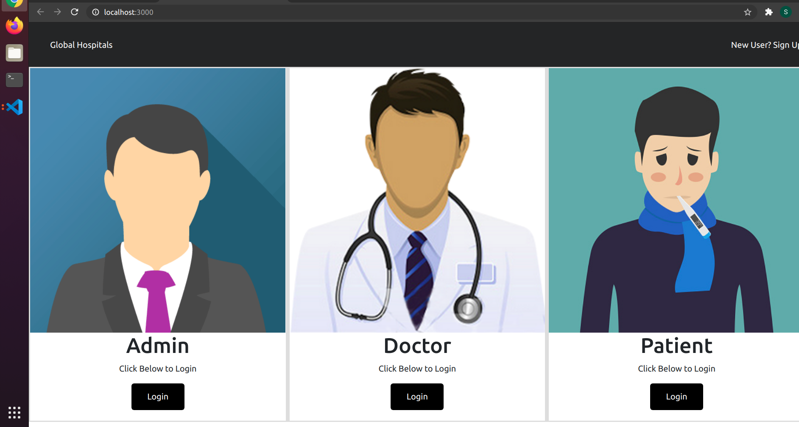
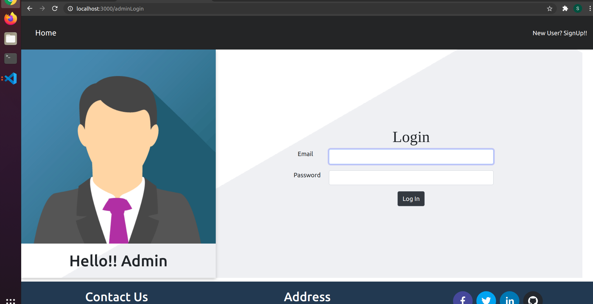
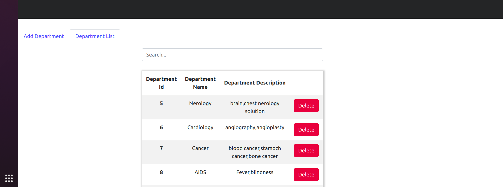

Hospital Management System (HMS)

Description

Welcome to the Hospital Management System (HMS) project.  This web-based application is designed to streamline hospital operations, making patient management and administrative tasks more efficient.

Project Purpose

The primary purpose of this project is to create a comprehensive Hospital Management System that simplifies various hospital processes, including patient registration, appointment scheduling, billing, and medical record management.

Learning Objectives

    Develop a full-stack web application using modern technologies.
    Understand and implement user authentication and authorization.
    Utilize database systems for data storage and retrieval.
    Implement responsive and user-friendly front-end interfaces.

Key Features

    Patient Registration and Management
    Appointment Scheduling
    Billing and Payment Processing
    Medical Records Management
    User Authentication and Authorization
    Admin Dashboard for Hospital Staff

Technologies

Front-end Technologies

    HTML5
    CSS3
    JavaScript (including React.js)

Back-end Technologies

    Go
    PHP
    Database: MySQL

Running Front End

cd client
npm install
npm start

Runs the app in the development mode.
Open http://localhost:3000 to view it in the browser.

Change the username and password in dbconnection.php file.
Design the required Databases.
run the server

Running Back End

server folder contains the PHP server.
server1 folder contains the Go Lang server 🙂

GO Lang Server: Run the GO Lang Server by running the following command in server1 folder

cd server1

go run main.go

Welcome Page

Cloning into the GitHub Repository

To clone this project's repository, use the following command:

git clone https://github.com/your_username/hospital-management-system.git

Future Improvements and Additional Functionality:

    Expand the functionality of the HMS by adding additional modules such as inventory management, pharmacy management, or laboratory management.
    Explore integration possibilities with external systems or services, such as electronic health records (EHR) systems or telemedicine platforms, to enhance patient care and data sharing.
    Implement advanced reporting and data analytics features to provide insights for hospital administrators and medical staff.
    Enhance security measures, including encryption and access control, to ensure the confidentiality of patient data.
    Consider mobile app development to provide patients and healthcare providers with on-the-go access to essential HMS features.
    Collaborate with medical professionals to identify specific needs and customize the HMS to meet unique requirements.
    Continuously update and maintain the project, addressing bug fixes and security vulnerabilities.

Author

Name: Salome Bassey 

GitHub:https://github.com/lomsey41
Twitter: http://www.twitter.com/lomsey41 
LinkedIn:http://www.linkedin.com/in/salome-bassey

Acknowledgement:

Nathaniel Emenike For his Technical Support.

License:

This project is licensed under the License  MIT. See the LICENSE file for details.
